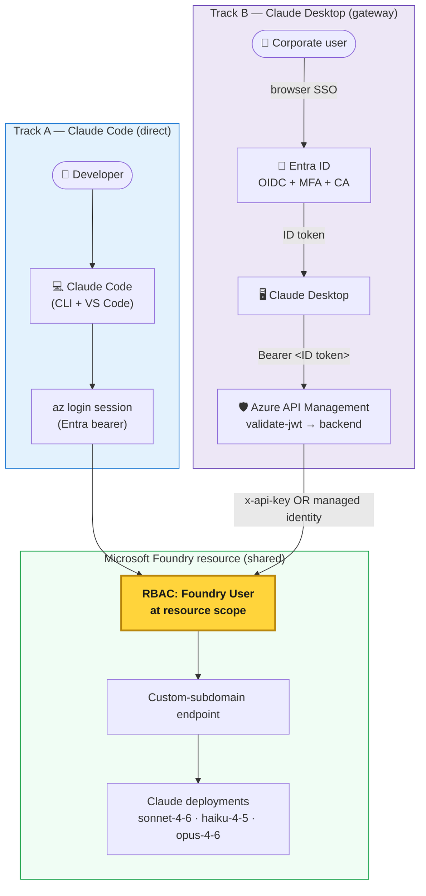

# Claude on Microsoft Foundry

Run **Anthropic Claude** against models hosted in **Microsoft Foundry**, with Entra ID identity, no shared API keys on developer laptops, and a paved path for both individual developers and enterprise rollouts.

This repo combines two field-tested setup patterns:

| Track | Client | Path to Foundry | Auth on the client | Who it's for |
|---|---|---|---|---|
| **A. Claude Code** | Claude Code CLI + VS Code extension | **Direct** — client calls Foundry directly | Per-user `az login` (Entra bearer) | Individual developers |
| **B. Claude Desktop** | Claude Desktop 1.5+ | **Gateway** — client calls APIM → APIM calls Foundry | Entra ID OIDC SSO (no keys on device) | Enterprise / IT rollout |

Both tracks share the same Foundry resource, the same Claude model deployments, and the same RBAC model (`Foundry User` at resource scope).

---

## Architecture (both tracks on one diagram)



For deeper architecture details see [docs/claude-code/architecture.md](docs/claude-code/architecture.md) (Track A) and [docs/claude-desktop/blog.md](docs/claude-desktop/blog.md) (Track B).

---

## Shared prerequisites

- **Azure subscription** with a **Microsoft Foundry / AI Services** account.
- A **Claude model deployment** on that account — at minimum `claude-sonnet-4-6`. Recommended: also `claude-haiku-4-5` and `claude-opus-4-6`.
- Foundry account must be in a region where Claude is offered (currently **East US 2**, **Sweden Central** — more regions coming; check [Microsoft Learn](https://learn.microsoft.com/azure/ai-foundry/foundry-models/concepts/models#anthropic) to confirm).
- The Foundry account must have a **custom subdomain** (required for AAD auth).
- **`Foundry User`** role assigned **at the Foundry resource scope** to whichever identity will call Foundry — the dev user (Track A) or the APIM managed identity (Track B). Role ID `53ca6127-db72-4b80-b1b0-d745d6d5456d`, formerly *Azure AI User*.
  > Per the [Foundry RBAC doc](https://learn.microsoft.com/en-us/azure/foundry/concepts/rbac-foundry?tabs=owner), roles starting with `Cognitive Services *` do **not** apply to Foundry. Older guidance that recommended *also* assigning `Cognitive Services User` is obsolete.
- **Azure CLI** logged into the right tenant.

---

## Track A — Claude Code (direct)

For individual developers running Claude Code against Foundry from their own machine.

**Setup at a glance:**

```bash
az login --tenant <foundry-tenant>
export CLAUDE_CODE_USE_FOUNDRY=1
export ANTHROPIC_FOUNDRY_RESOURCE=<foundry-account>
claude   # then type /status — expect: "API provider: Microsoft Foundry"
```

Or use the bundled scripts:

```powershell
# Windows
./scripts/claude-code/setup-foundry.ps1 -ResourceName <foundry-account> -TenantId <tenant>
./scripts/claude-code/verify-setup.ps1
```

```bash
# macOS / Linux / WSL
./scripts/claude-code/setup-foundry.sh <foundry-account> <tenant>
./scripts/claude-code/verify-setup.sh
```

> **Windows note:** Claude Code CLI needs a POSIX shell. Set env vars in PowerShell, then launch `claude` from **Git Bash** or **WSL2** — not `cmd.exe` / PowerShell.

**Deep dives:**
- [docs/claude-code/setup-guide.md](docs/claude-code/setup-guide.md) — full walkthrough
- [docs/claude-code/blog.md](docs/claude-code/blog.md) — narrative blog post
- [docs/claude-code/architecture.md](docs/claude-code/architecture.md) — request flow
- [examples/claude-code/vscode-settings.sample.json](examples/claude-code/vscode-settings.sample.json) — VS Code config
- [examples/claude-code/CLAUDE.md](examples/claude-code/CLAUDE.md) — sample CLAUDE.md to drop into a project

---

## Track B — Claude Desktop (gateway with Entra SSO)

For enterprise rollouts where the Foundry key must never land on user laptops and every request must carry the user's Entra identity.

**Setup at a glance:**

```powershell
# 1. Fill in .env
Copy-Item .env.example .env
notepad .env

# 2. Log in to the correct tenant
az login --tenant <your-tenant-id>

# 3. (Skip if you already have an APIM service)
./scripts/claude-desktop/create-apim.ps1

# 4. Register the Entra app + push APIM Named values
./scripts/claude-desktop/register-claude-entra-app.ps1
```

Then follow [docs/claude-desktop/blog.md](docs/claude-desktop/blog.md) from **Step 2** onward to wire up the APIM API, the `validate-jwt` inbound policy, and Claude Desktop's Gateway SSO settings.

**Deep dives:**
- [docs/claude-desktop/blog.md](docs/claude-desktop/blog.md) — full walkthrough with screenshots, policy XML, and Claude Desktop config

---

## Shared troubleshooting & enablement

- [docs/troubleshooting.md](docs/troubleshooting.md) — Top-12 gotchas matrix (env-var inheritance, RBAC scope, wrong tenant, etc.)
- [enablement/cheat-sheet.md](enablement/cheat-sheet.md) — one-page reference
- [enablement/scenarios.md](enablement/scenarios.md) — diagnostic walks for common customer questions

---

## Repo layout

```
claude-on-foundry/
├── docs/
│   ├── troubleshooting.md          shared, both tracks
│   ├── claude-code/                Track A docs
│   └── claude-desktop/             Track B docs
├── scripts/
│   ├── claude-code/                setup-foundry + verify-setup (.ps1 / .sh)
│   └── claude-desktop/             create-apim + register-claude-entra-app (.ps1)
├── examples/
│   └── claude-code/                CLAUDE.md, prompts, sample-project, VS Code settings
├── enablement/                     cheat sheet + field scenarios
├── images/
│   ├── claude-code/
│   └── claude-desktop/
├── .env.example                    sectioned by track
└── .gitignore
```

---

## Common failure modes (both tracks)

| Symptom | Most likely cause |
|---|---|
| `API provider: Anthropic` in Claude Code `/status` | Env vars not inherited by the launching process (Track A) |
| 401 / 403 from Foundry | `Foundry User` not assigned at the **resource** scope, or assigned at subscription scope of a different sub |
| `baseURL and resource are mutually exclusive` | Both `ANTHROPIC_BASE_URL` and `ANTHROPIC_FOUNDRY_RESOURCE` set (Track A) |
| `Unable to get authority for /<guid>` | `az login` is on the wrong tenant |
| Claude Desktop `Token exchange failed (HTTP 401)` | Entra app was registered under **Web** instead of **Mobile and desktop applications** platform (Track B) |
| APIM returns 200 but Foundry returns 404 | API-version / path mismatch on the `/anthropic` backend (Track B) |

Full table: [docs/troubleshooting.md](docs/troubleshooting.md).

---

## Contributing

Found a new failure mode in the field? Add a row to [docs/troubleshooting.md](docs/troubleshooting.md), or extend [enablement/scenarios.md](enablement/scenarios.md), and open a PR. The value compounds with every captured scenario.

---

## License

MIT — see [LICENSE](LICENSE).
