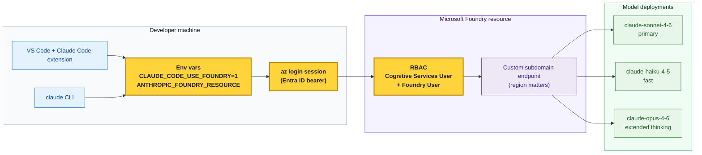

# Architecture

The mental model. Every failure maps to one arrow on this diagram.

**Yellow boxes = where 90% of customer failures occur.**

- **Env vars**: not inherited by the launching process (the #1 silent failure)
- **az login session**: wrong tenant, or token expired
- **RBAC**: only one of the two required roles assigned

---

## Request flow

1. Developer runs `claude` (or types in the VS Code panel)
2. Claude Code reads `CLAUDE_CODE_USE_FOUNDRY` → decides to route to Foundry
3. Claude Code reads `ANTHROPIC_FOUNDRY_RESOURCE` → builds the endpoint URL
4. Claude Code attaches the Entra ID bearer token from the current `az login` session
5. Foundry validates RBAC (both roles required)
6. Foundry routes the request to the deployment whose role matches (primary / fast / extended thinking)
7. Response streams back through the same path

---

## Why the env-var inheritance trap exists

Environment variables are copied from a parent process to its children **at fork time**. Setting them in a terminal AFTER launching VS Code from the Start menu has no effect on the already-running VS Code process tree. The fix is always the same: set env vars first, then launch the consumer.
