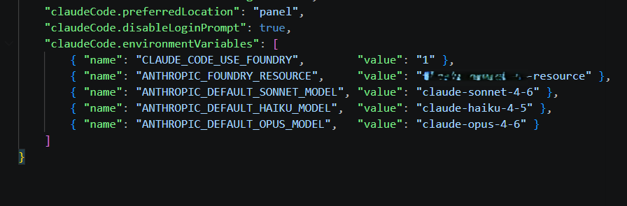

# Claude Code on Microsoft Foundry in VS Code — A Practical Setup Guide (with the gotchas)

> Running Claude Code through Microsoft Foundry enables enterprise-grade governance without changing your developer workflow.

The official Microsoft Learn article ([Configure Claude Code for Microsoft Foundry](https://learn.microsoft.com/en-us/azure/foundry/foundry-models/how-to/configure-claude-code?tabs=powershell)) gets you ~80% of the way there. The remaining 20%—VS Code settings shape, tenant mismatches, and configuration conflicts like "baseURL and resource are mutually exclusive"—is where most setups fail in practice.

This guide walks the full path end-to-end, with the exact JSON that validates, working CLI configuration, and a troubleshooting matrix based on real-world failures. This guidance is based on repeated customer deployments and internal testing across both CLI and VS Code scenarios.

---

## TL;DR

**Setup**
- Deploy `claude-sonnet-4-6` (optionally Haiku + Opus) in a supported region
- Grant `Cognitive Services User` + `Foundry User`
- `az login --tenant <tenant>`, then launch VS Code via `code .`

**Config**
- CLI:
  - `CLAUDE_CODE_USE_FOUNDRY=1`
  - `ANTHROPIC_FOUNDRY_RESOURCE=<name>`
  - Do **NOT** set `ANTHROPIC_FOUNDRY_BASE_URL` at the same time
- VS Code:
  - Use `[{ "name": "...", "value": "..." }]` format

**Validate**
- `claude → /status`
- Expect: `API provider: Microsoft Foundry`

---

## Why run Claude Code on Foundry?

Anthropic's Claude Code is a top-tier agentic coding assistant. Running it through Microsoft Foundry instead of Anthropic's public API gives you:

- **Data residency & compliance**: prompts and completions stay inside your Azure tenant.
- **Entra ID auth**: no API keys to rotate; centralized RBAC.
- **Private networking**: works behind VNets/Private Endpoints.
- **Unified billing & quotas**: usage shows up on your Azure invoice and in Foundry monitoring.

Same model, same CLI, enterprise-grade plumbing underneath.

---

## Prerequisites checklist

| Requirement | How to verify |
|---|---|
| Azure subscription with pay-as-you-go billing | `az account show` |
| Foundry resource in supported regions | Check your region's model availability in Foundry portal |
| Contributor/Owner on the resource group (for deployments) | Azure Portal → IAM |
| **Cognitive Services User** + **Foundry User** on the resource (for invoking) | Azure Portal → IAM |
| Azure CLI installed and logged in | `az --version`, `az login` |
| Claude Code CLI installed | `claude --version` |
| VS Code (current) with the Anthropic Claude Code extension | Help → About |
| **Windows only:** Git Bash (from Git for Windows) or WSL2 — Claude Code's runtime requires a POSIX shell | `bash --version` in Git Bash / WSL |

> ⚠️ Claude models in Foundry are currently available in select regions. Check the Foundry portal model catalog for your region's availability (commonly East US 2 and Sweden Central).

---

## Step 1 — Deploy the Claude models

Claude Code uses **three model roles**, and it expects a deployment for each:

| Role | Default deployment name | Used for |
|---|---|---|
| Primary | `claude-sonnet-4-6` | general coding (balanced) |
| Fast | `claude-haiku-4-5` | quick edits, file reads |
| Extended thinking | `claude-opus-4-6` | complex reasoning |

Deploy at least Sonnet to get started. Add Haiku and Opus when you need them — Claude Code will route automatically. If a role-specific model isn't deployed, Claude Code may fall back or fail depending on the task.

> Deployment names in this guide follow the current Claude 4.x naming exposed in Foundry. Exact versions change over time — check the Foundry model catalog in your region for what's currently available.

**Foundry Portal:** AI Foundry → your project → **Build → Models + endpoints** → **+ Deploy model** → pick the Anthropic Claude model → Global Standard deployment → name it exactly as above (or remember the name to override later).

To discover the current model version before deploying (replace `eastus2` with your Foundry region):

```powershell
az cognitiveservices model list -l eastus2 `
  --query "[?contains(model.name,'claude')].{name:model.name, version:model.version, format:model.format}" -o table
```

**Azure CLI:**
```powershell
az cognitiveservices account deployment create `
  --name <foundry-resource> `
  --resource-group <rg> `
  --deployment-name claude-sonnet-4-6 `
  --model-name claude-sonnet-4-6 `
  --model-version <version> `
  --model-format Anthropic `
  --sku-name GlobalStandard `
  --sku-capacity 1
```

✍️ *Figure 1: Foundry portal “Models + endpoints” showing the three Claude deployments.*


---

## Step 2 — Grant yourself the right roles

This is the #1 source of silent failures. You need **both**:

| Role | Role ID | Purpose |
|---|---|---|
| **Cognitive Services User** | `a97b65f3-24c7-4388-baec-2e87135dc908` | data-plane invocation |
| **Foundry User** *(formerly Azure AI User)* | `53ca6127-db72-4b80-b1b0-d745d6d5456d` | Foundry-native permissions |

```powershell
$me = az ad signed-in-user show --query id -o tsv
$scope = az cognitiveservices account show -n <foundry-resource> -g <rg> --query id -o tsv

# Use role IDs — rename-proof (works whether the display name is "Azure AI User" or "Foundry User")
az role assignment create --assignee $me --role a97b65f3-24c7-4388-baec-2e87135dc908 --scope $scope  # Cognitive Services User
az role assignment create --assignee $me --role 53ca6127-db72-4b80-b1b0-d745d6d5456d --scope $scope  # Foundry User (formerly Azure AI User)
```

> The Foundry RBAC rename (Azure AI User → Foundry User) is rolling out; both role names map to the same role definition (same role ID), depending on tenant rollout state. Use whichever role name your tenant exposes — or use the role IDs above to avoid ambiguity.

---

## Step 3 — Install the Claude Code CLI

Use the official installer from Anthropic (auto-updates in the background):

```powershell
irm https://claude.ai/install.ps1 | iex
claude --version
```

If `claude` isn't on PATH, restart your shell. The installer drops it under `%USERPROFILE%\.local\bin`.

---

## Step 4 — Sign in to the **right** tenant

If your Foundry resource lives in a tenant different from your default, an `az login` to the wrong tenant produces the cryptic error:

```
ValueError: Unable to get authority configuration for
https://login.microsoftonline.com/<bad-guid>.
Authority would typically be in a format of
https://login.microsoftonline.com/your_tenant
```

Fix:
```powershell
az login --tenant <foundry-tenant-guid>
az account set --subscription <foundry-subscription-guid>
az account show   # confirm tenant & subscription
```

> 💡 You can list every tenant you have access to with:
> `az account list --query "[].{name:name, tenantId:tenantId}" -o table`

---

## Step 5 — Configure the CLI

Set these in the same PowerShell session you'll launch `claude` from:

```powershell
$env:CLAUDE_CODE_USE_FOUNDRY     = "1"
$env:ANTHROPIC_FOUNDRY_RESOURCE  = "<your-foundry-resource-name>"

# Optional: only if your deployment names differ from the defaults
$env:ANTHROPIC_DEFAULT_SONNET_MODEL = "claude-sonnet-4-6"
$env:ANTHROPIC_DEFAULT_HAIKU_MODEL  = "claude-haiku-4-5"
$env:ANTHROPIC_DEFAULT_OPUS_MODEL   = "claude-opus-4-6"
```

To make them persistent: `setx CLAUDE_CODE_USE_FOUNDRY 1` (and so on), then **sign out and back in** (or restart Explorer). GUI apps like VS Code launched from the Start menu only pick up new user-env vars after the user session refreshes — opening a fresh terminal isn't enough.

### 🚫 The "mutually exclusive" trap

```
API Error: baseURL and resource are mutually exclusive
```

You'll hit this if you set **both** `ANTHROPIC_FOUNDRY_RESOURCE` and `ANTHROPIC_FOUNDRY_BASE_URL`. Pick one:

- Most users → `ANTHROPIC_FOUNDRY_RESOURCE=<name>` (Claude Code builds the URL).
- Custom subdomain / private endpoint → use `ANTHROPIC_FOUNDRY_BASE_URL` *instead*.

---

## Step 6 — Verify the CLI

```powershell
claude
> /status
```

Expected output:

```
API provider:                 Microsoft Foundry
Microsoft Foundry base URL:   https://<resource>.services.ai.azure.com/anthropic
Microsoft Foundry resource:   <resource>
Model:                        Default (claude-sonnet-4-6)
```

✍️ *Figure 2: `/status` output confirming `API provider: Microsoft Foundry`.*


If you instead see "Anthropic" or it prompts for an Anthropic login, `CLAUDE_CODE_USE_FOUNDRY` isn't being inherited — see troubleshooting below.

---

## Step 7 — Configure the VS Code extension

Install **Claude Code** from the VS Code Marketplace (publisher: Anthropic).

Open user `settings.json` (`Ctrl+Shift+P` → *Preferences: Open User Settings (JSON)*) and add:

```jsonc
"claudeCode.environmentVariables": [
  { "name": "CLAUDE_CODE_USE_FOUNDRY",    "value": "1" },
  { "name": "ANTHROPIC_FOUNDRY_RESOURCE", "value": "<your-foundry-resource-name>" }
]
```

> 🪤 **Schema gotcha.** The MS Learn doc currently shows this as a plain `{KEY: VALUE}` object under the UI label `"Claude Code: Environment Variables"`. In recent extension versions the actual JSON key is `claudeCode.environmentVariables` and the value must be an **array of `{name, value}` objects**. If you paste the doc's snippet verbatim, VS Code will flag *"Missing property name", "Colon expected", "Unknown configuration setting"*. Use the array form above.

### Make the extension see your `az login`

The extension inherits environment & credentials from the process that launches VS Code. After `az login`:

```powershell
# In the same PowerShell where az login succeeded:
code .
```

If VS Code was already running, **fully quit it** (not just close the window) and relaunch from the terminal. `Developer: Reload Window` is **not enough** to refresh inherited Azure CLI credentials.

✍️ *Figure 3: `settings.json` with the `claudeCode.environmentVariables` array form.*



---

## Step 8 — Try it

In VS Code, click the Claude Code (Spark) icon in the sidebar to open the panel. Type:

```
Summarize the structure of this project.
```

You should get a response within a few seconds, and the panel should indicate it's routing through Microsoft Foundry. Run `/status` inside the panel to confirm `API provider: Microsoft Foundry` if you want certainty.

✍️ *Figure 4: Claude Code panel in VS Code responding through Microsoft Foundry.*


---

## Troubleshooting matrix

| Symptom | Where it shows up | Likely cause | Fix |
|---|---|---|---|
| `API Error: baseURL and resource are mutually exclusive` | `claude` CLI on first request | Both `ANTHROPIC_FOUNDRY_BASE_URL` and `ANTHROPIC_FOUNDRY_RESOURCE` set | Unset one. Prefer `ANTHROPIC_FOUNDRY_RESOURCE`. |
| `Unable to get authority configuration for https://login.microsoftonline.com/<guid>` | `claude` CLI startup or VS Code panel | Wrong tenant ID in `az login` | `az login --tenant <correct-guid>`; verify with `az account show` |
| `Failed to get token from azureADTokenProvider: ChainedTokenCredential authentication failed` | VS Code Claude Code panel | Extension didn't inherit `az login` session | Quit VS Code entirely; relaunch with `code .` from the authed shell |
| `Token tenant does not match resource tenant` | `claude` CLI or VS Code panel | CLI logged into a different tenant than the Foundry resource | `az login --tenant <foundry-tenant>` |
| `The model <name> is not available on your foundry deployment` | `claude` CLI first use or VS Code model selector | Deployment name mismatch | Either rename the Foundry deployment, or set `ANTHROPIC_DEFAULT_*_MODEL` to the actual name |
| `401 / 403` on first request | `claude` CLI or VS Code panel | Missing RBAC on the resource | Assign **Cognitive Services User** *and* **Foundry User** on the resource scope |
| Claude Code prompts for Anthropic login | VS Code Claude Code panel | `CLAUDE_CODE_USE_FOUNDRY` not set in the process | Set the env var **before** launching `claude` / `code .` |
| VS Code shows "Unknown Configuration Setting" for `claudeCode.environmentVariables` | VS Code Settings tab | Wrong JSON shape | Use the **array of `{name,value}` objects** form |
| `429 Too Many Requests` | `claude` CLI or VS Code panel | TPM/RPM exhausted | Foundry portal → **Operate → Quotas**; request increase or reduce parallelism |
| Works in CLI, fails in VS Code extension | VS Code Claude Code panel only | Env vars set per-shell, not visible to GUI VS Code | Use `setx` (persistent user env) or move them into `claudeCode.environmentVariables` |
| "Model is not available in region" | Foundry portal model deployment step | Foundry resource not in a supported region | Deploy a new Foundry resource in a supported region, or check model availability |

---

## Best practices

**Auth & secrets**
- Prefer Entra ID over API keys. If you must use a key for CI, store it as a secret (GitHub Actions secret, Key Vault) — never in `settings.json` (it may sync via Settings Sync).
- Scope RBAC at the **resource** level, not the subscription, for least privilege.

**Project context**
- Create a `CLAUDE.md` at your repo root with stack, conventions, and entry-point commands. Claude Code reads it automatically and the quality jump is significant.
- Use `.claude/rules/*.md` for per-area rules (e.g., test conventions, security rules).

**Cost & latency**
- Let Claude Code's auto-routing pick the right role (Sonnet/Haiku/Opus). Don't pin everything to Opus.
- Cap context with `ANTHROPIC_MAX_TOKENS` if you have a strict budget. *(Note: not honored by every Claude Code version — check [the Claude Code docs](https://docs.anthropic.com/en/docs/claude-code) for your version.)*
- Watch token spend in **Foundry → Operate → Metrics** weekly.

**Reliability**
- For team use, deploy all three model roles even if you don't think you need them — silent role-routing failures are confusing.
- Tag your Foundry resource (`env=dev|prod`, `team=...`) for chargeback.

**Reproducibility**
- Document the exact env vars and `az login --tenant` GUID in your team README.
- Pin Claude Code CLI version in onboarding docs (`claude --version`) so new joiners hit the same behavior.

---

## A note on the MS Learn doc

The doc is accurate but skips three things that caused the most friction in real-world deployments:

1. **VS Code extension settings shape** — the example uses the UI label as a JSON key and an object instead of the array form the schema actually expects.
2. **Process inheritance** — it says "set the env vars" but doesn't emphasize that the **VS Code window must be launched from a shell where both `az login` and the env vars are live**. Reloading the window doesn't help.
3. **Mutually exclusive `RESOURCE` vs `BASE_URL`** — listed in passing, but the error message only appears at first request, after you think everything is configured.

If the Microsoft Learn page is updated, treat this post as a companion — same destination, fewer dead ends.

---

## What you've got now

- Claude Code running locally on your machine, talking to **your** Foundry resource.
- Entra ID auth — no API keys to manage.
- Full Foundry telemetry, quotas, and billing.
- VS Code panel + CLI, both backed by the same setup.

Drop a `CLAUDE.md` in your repo and start shipping.

---

## When to Use RESOURCE vs BASE_URL

Use RESOURCE (default)
- Standard public deployments
- No custom networking

Use BASE_URL
- Private endpoints
- Custom DNS / VNet routing

Never set both.

