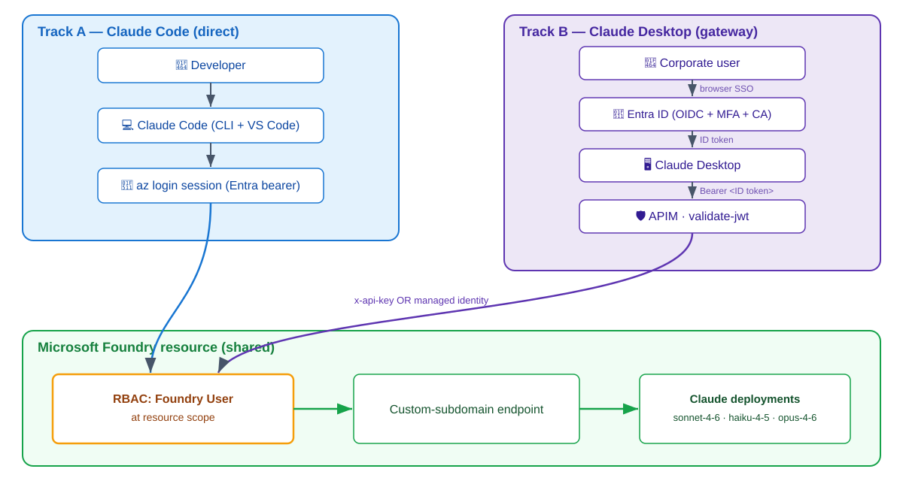

<!-- _class: lead -->
<!-- _paginate: false -->


# Claude on Microsoft Foundry

## Anthropic Claude, Entra identity, no shared keys

Run Claude against models hosted in Microsoft Foundry —
a paved path for individual developers **and** enterprise rollouts.

<!--
Speaker notes:
- Welcome. Today: how to run Anthropic's Claude models when they're hosted inside Microsoft Foundry.
- Two audiences in mind: developers who want Claude Code on their laptop, and IT/security who need governed enterprise access.
- Goal of the talk: by the end you'll know which of two tracks fits you and the exact gotchas that trip people up.
-->

---

# Why this talk

- Claude is now a **first-class model family inside Microsoft Foundry** — same resource, same RBAC, same region story as every other Foundry model.
- Two very different consumers want it:
  - **Developers** → Claude Code on their laptop, today.
  - **Enterprises** → governed access with no API keys on devices.
- The hard part isn't "calling an API" — it's **identity, RBAC, and environment setup**.
- This deck = the field-tested patterns + the gotchas that actually bite.

<!--
- Frame the problem: getting a token to Claude is easy; doing it without leaking keys and with proper identity is the real work.
- Everything here comes from real customer engagements — the gotchas are battle scars.
-->

---

# The big idea: one Foundry, two tracks

| | **Track A — Claude Code** | **Track B — Claude Desktop** |
| --- | --- | --- |
| Client | Claude Code CLI + VS Code | Claude Desktop 1.5+ |
| Path to Foundry | **Direct** | **Gateway** (APIM) |
| Auth on client | Per-user `az login` (Entra bearer) | Entra ID OIDC SSO |
| Keys on device | None (token cache) | None |
| Who it's for | Individual developers | Enterprise / IT rollout |

**Shared foundation:** same Foundry resource · same Claude deployments · same `Foundry User` RBAC at resource scope.

<!--
- This is the mental model for the whole talk. Keep coming back to this table.
- The shared foundation line is important: you stand up Foundry once, both tracks reuse it.
-->

---

# Architecture at a glance

<div class="cols">
<div class="col">
<div class="trackA">

**Track A — direct**

👤 Developer
→ 💻 Claude Code (CLI + VS Code)
→ 🔑 `az login` session (Entra bearer)
→ **Foundry**

</div>
</div>
<div class="col">
<div class="trackB">

**Track B — gateway**

👤 Corporate user
→ 🖥️ Claude Desktop
→ 🔑 Entra ID (OIDC + MFA + CA)
→ 🛡️ APIM `validate-jwt`
→ **Foundry**

</div>
</div>
</div>

<div class="foundry">

**Microsoft Foundry (shared):** `Foundry User` RBAC → custom-subdomain endpoint → Claude deployments (`sonnet-4-6` · `haiku-4-5` · `opus-4-6`)

</div>

<!--
- Left path: token goes straight from the laptop to Foundry. Simple, per-developer.
- Right path: Claude Desktop never sees Foundry directly — APIM sits in the middle, validates the user's Entra JWT, then forwards.
- Both converge on the same Foundry RBAC + endpoint + deployments at the bottom.
-->

---

# Architecture — full request flow



<!--
- This is the detailed version of the previous slide — same two tracks, drawn out node by node.
- Track A (left, blue): developer's az login bearer token flows straight down into Foundry's RBAC gate.
- Track B (right, purple): user proves identity to Entra (MFA + CA), Claude Desktop carries the ID token to APIM, APIM validates the JWT and forwards using x-api-key or its managed identity.
- Both arrows land on the SAME amber RBAC node — Foundry User at resource scope. From there: endpoint → Claude deployments.
- Takeaway: the RBAC gate is the single choke point both tracks must pass.
-->

---

# Shared prerequisites

- **Azure subscription** with a **Microsoft Foundry / AI Services** account.
- A **Claude model deployment** — minimum `claude-sonnet-4-6` (recommend also `haiku-4-5`, `opus-4-6`).
- Account in a region where Claude is offered — currently **East US 2** and **Sweden Central** (more coming).
- A **custom subdomain** on the Foundry account → **required for AAD auth**.
- **`Foundry User`** role assigned **at the Foundry resource scope**.
- **Azure CLI** logged into the **right tenant**.

<div class="gotcha">

⚠️ Region + custom subdomain are the two setup steps people skip — and both block auth entirely.

</div>

<!--
- Walk each bullet. Emphasize region: if Claude isn't offered there, nothing else matters.
- Custom subdomain: without it, AAD token auth simply won't work — you'd be stuck on keys.
- Right tenant: a surprising number of failures are just az login on the wrong tenant.
-->

---

# RBAC: get this one right

- Assign **`Foundry User`** (role ID `53ca6127-db72-4b80-b1b0-d745d6d5456d`, formerly *Azure AI User*).
- Scope it **at the Foundry resource**, not the subscription of a different sub.
- Assign it to whichever **identity actually calls Foundry**:
  - Track A → the **developer user**.
  - Track B → the **APIM managed identity**.

<div class="gotcha">

⚠️ Roles starting with `Cognitive Services *` do **not** apply to Foundry. Old guidance to also add *Cognitive Services User* is **obsolete** — skip it.

</div>

<!--
- This single slide prevents the most common 401/403 in the field.
- The renamed role confuses people: Azure AI User == Foundry User, same ID, same perms.
- The Cognitive Services trap: people copy old blog posts and add the wrong role; it does nothing here.
-->

---

<!-- _class: lead -->

# Track A
## Claude Code — direct to Foundry

For individual developers, on their own machine, today.

<!--
- Shift gears. This is the developer-self-serve story.
- No infrastructure to stand up beyond the shared Foundry — the dev just configures their shell.
-->

---

# Track A — how it works

1. Developer runs `az login` → Entra **bearer token** lands in the local token cache.
2. Env vars tell Claude Code to use **Foundry** as the provider.
3. Claude Code calls the Foundry endpoint **directly** with the bearer token (audience `https://ai.azure.com`).
4. Foundry checks **`Foundry User`** RBAC → routes to the Claude deployment.

- No API keys anywhere. No gateway. No shared secrets.
- Token lifecycle = the developer's normal `az login` session.

<!--
- Emphasize: DefaultAzureCredential under the hood; the same token cache az CLI populates.
- disableLocalAuth is on at the Foundry resource, so there literally are no keys to leak.
-->

---

# Track A — setup in 6 lines

```bash
az login --tenant <foundry-tenant>
export CLAUDE_CODE_USE_FOUNDRY=1
export ANTHROPIC_FOUNDRY_RESOURCE=<foundry-account>   # account NAME, not URL

claude            # then type /status
# expect: "API provider: Microsoft Foundry"
```

- Deployments are **auto-discovered by name** inside that resource.
- Only override if your deployment names differ from defaults:
  `ANTHROPIC_DEFAULT_SONNET_MODEL` · `ANTHROPIC_DEFAULT_HAIKU_MODEL` · `ANTHROPIC_DEFAULT_OPUS_MODEL`

<div class="gotcha">

⚠️ `ANTHROPIC_FOUNDRY_RESOURCE` is the **account name**, not an endpoint URL.

</div>

<!--
- The /status check is your single best "did it work?" signal.
- The default-named deployments (claude-sonnet-4-6 etc.) need zero overrides — that's the happy path.
- Foundry uses ANTHROPIC_DEFAULT_*_MODEL, NOT the Bedrock/Vertex ANTHROPIC_MODEL convention — a common copy-paste mistake.
-->

---

# Track A — or just run the scripts

```powershell
# Windows
./scripts/claude-code/setup-foundry.ps1 -ResourceName <foundry-account> -TenantId <tenant>
./scripts/claude-code/verify-setup.ps1
```

```bash
# macOS / Linux / WSL
./scripts/claude-code/setup-foundry.sh <foundry-account> <tenant>
./scripts/claude-code/verify-setup.sh
```

- `setup-foundry` → sets env vars + logs you in.
- `verify-setup` → confirms tenant, RBAC, endpoint, and provider before you start.

<!--
- For people who don't want to memorize env vars, the repo ships scripts for both shells.
- verify-setup is the "save yourself a support ticket" step.
-->

---

# Track A — Windows reality check

<div class="gotcha">

⚠️ Claude Code CLI needs a **POSIX shell**. Native PowerShell / `cmd.exe` can't run `claude` directly.

</div>

- Use **Git Bash** or **WSL2** to launch `claude`.
- PowerShell *can* `az login`, set env vars, and launch `code .` / `bash` — it just can't run the CLI itself.
- Env vars **only live in the shell that set them** — launch VS Code from that same shell, or use `setx` / `~/.bashrc`.
- **`Reload Window` does NOT re-read parent env vars** → fully quit and relaunch VS Code.

<!--
- This slide alone saves Windows users an hour of confusion.
- The reload-window trap is subtle: people change env vars, reload, and wonder why nothing changed.
-->

---

# Track A — VS Code extension settings

- `claudeCode.environmentVariables` must be an **array of `{name, value}` objects**.
  - MS Learn shows the object form → extension **silently falls back to Anthropic**.
- `claudeCode.disableLoginPrompt: true`
  - Foundry users auth via `az login`; the Anthropic sign-in prompt is misleading and **pollutes the session** with a public token.
- `claudeCode.preferredLocation: "panel"` — preference only.

<div class="gotcha">

⚠️ Wrong shape for `environmentVariables` = silent fallback to public Anthropic. No error, just wrong provider.

</div>

<!--
- "Silent fallback" is the worst failure mode because there's no error — /status is how you catch it.
- disableLoginPrompt prevents a well-meaning user from clicking sign-in and grabbing a public Anthropic token.
-->

---

<!-- _class: lead -->

# Track B
## Claude Desktop — gateway with Entra SSO

For enterprises: no Foundry key on any laptop, every request carries the user's identity.

<!--
- Now the enterprise/IT story. Different threat model: assume the laptop is hostile / unmanaged.
- The whole point: keep the Foundry credential server-side, behind APIM.
-->

---

# Track B — how it works

1. User signs in via **Entra ID OIDC** in the browser (MFA + Conditional Access apply).
2. Claude Desktop receives an **ID token** and sends it as `Bearer` to **APIM**.
3. APIM `validate-jwt` inbound policy **verifies** the token (issuer, audience, claims).
4. APIM forwards to Foundry using its **managed identity** (or key) — the client never sees it.
5. Foundry checks **`Foundry User`** RBAC on the **APIM identity** → Claude deployment.

- Foundry credential **never leaves Azure**. Full Conditional Access + MFA enforcement.

<!--
- The key architectural difference vs Track A: identity is brokered. The user proves who they are to Entra; APIM proves it has rights to Foundry.
- This is what lets security teams say yes — CA, MFA, and audit all live in Entra + APIM.
-->

---

# Track B — setup at a glance

```powershell
# 1. Fill in .env
Copy-Item .env.example .env ; notepad .env

# 2. Log in to the correct tenant
az login --tenant <your-tenant-id>

# 3. (Skip if you already have APIM)
./scripts/claude-desktop/create-apim.ps1

# 4. Register the Entra app + push APIM named values
./scripts/claude-desktop/register-claude-entra-app.ps1
```

Then wire up the APIM API, the `validate-jwt` inbound policy, and Claude Desktop's Gateway SSO settings.

<!--
- Four scripted steps get the plumbing in place; the manual wiring is the policy + Claude Desktop config.
- create-apim is optional — most enterprises already have an APIM instance.
-->

---

# Track B — the platform-type gotcha

<div class="gotcha">

⚠️ Register the Entra app under **"Mobile and desktop applications"**, **not** "Web".

</div>

- Wrong platform → `Token exchange failed (HTTP 401)` in Claude Desktop.
- The redirect URI and token-exchange flow differ between the two platform types.
- Double-check the **app registration → Authentication** blade before debugging anything else.

<!--
- This is THE Track B gotcha. The symptom (token exchange 401) sends people down rabbit holes.
- Always check the platform type first when SSO fails.
-->

---

# Troubleshooting — top failure modes

| Symptom | Most likely cause |
| --- | --- |
| `/status` shows **API provider: Anthropic** | Env vars not inherited by launching process (A) |
| **401 / 403** from Foundry | `Foundry User` not at **resource** scope |
| `baseURL and resource are mutually exclusive` | Both `ANTHROPIC_BASE_URL` **and** `ANTHROPIC_FOUNDRY_RESOURCE` set (A) |
| `Unable to get authority for /<guid>` | `az login` on the **wrong tenant** |
| `Token exchange failed (HTTP 401)` | Entra app registered as **Web** not desktop (B) |
| APIM 200 but Foundry **404** | API-version / path mismatch on `/anthropic` backend (B) |

Full matrix: `docs/troubleshooting.md`.

<!--
- This is your "when it breaks, look here" slide. Each row maps to something earlier in the deck.
- Notice how many trace back to identity/env — that's the recurring theme.
-->

---

# Decision guide — which track?

<div class="cols">
<div class="col">
<div class="trackA">

**Choose Track A if…**

- Individual / small team of devs
- Comfortable with `az login`
- Want Claude Code in the terminal + VS Code
- No need to broker identity through a gateway

</div>
</div>
<div class="col">
<div class="trackB">

**Choose Track B if…**

- Enterprise / IT-governed rollout
- Foundry key must never touch laptops
- Need MFA + Conditional Access on every call
- Using Claude **Desktop** as the client

</div>
</div>
</div>

You can run **both** — same Foundry, same deployments, same RBAC model.

<!--
- Make it actionable: most orgs start with Track A for a pilot, then add Track B for broad rollout.
- Reassure: adopting one doesn't preclude the other; they share the backend.
-->

---

# Resources & enablement

- **Setup walkthroughs** — `docs/claude-code/setup-guide.md`, `docs/claude-desktop/blog.md`
- **Architecture deep-dive** — `docs/claude-code/architecture.md`
- **Scripts** — `scripts/claude-code/`, `scripts/claude-desktop/`
- **Sample config** — `examples/claude-code/vscode-settings.sample.json`, `CLAUDE.md`
- **Field enablement** — `enablement/cheat-sheet.md`, `enablement/scenarios.md`
- **Troubleshooting matrix** — `docs/troubleshooting.md`

Repo: **`lindazhang2000/claude-on-foundry`**

<!--
- Point people at the repo; everything in this talk is reproducible from it.
- Cheat sheet is the one-pager to hand out after the session.
-->

---

<!-- _class: lead -->
<!-- _paginate: false -->


# Key takeaways

1. **One Foundry, two tracks** — direct (devs) and gateway (enterprise).
2. **Identity is the work** — `Foundry User` at resource scope, right tenant, custom subdomain.
3. **Know the gotchas** — env-var inheritance, role naming, platform type, `/status` check.

## Questions?

<!--
- Land the three takeaways. If they remember nothing else: identity is the hard part, and these gotchas are the difference between "works" and "mysterious 401".
- Open for Q&A. Common questions: cost, region expansion, mixing both tracks, token lifetime.
-->
